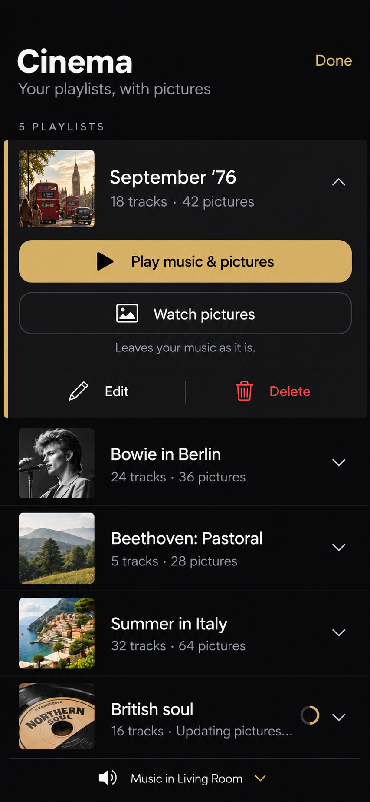
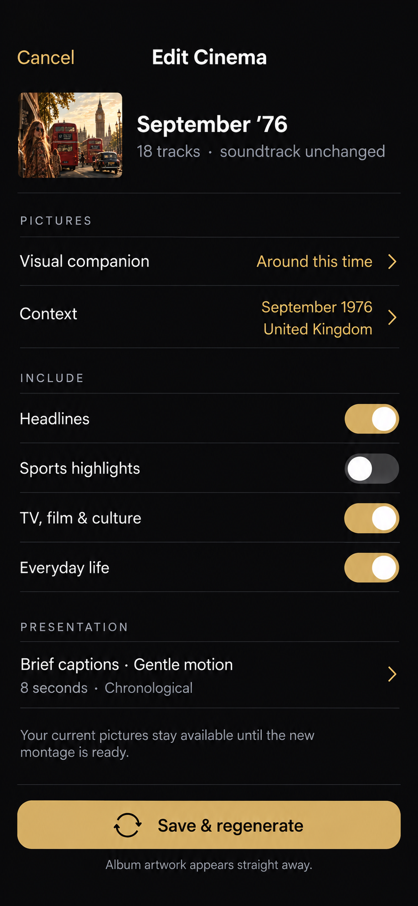
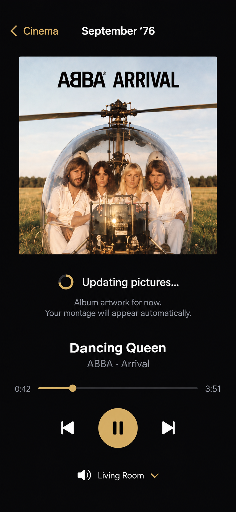
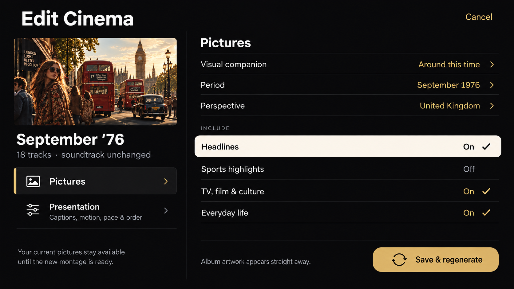

# Cinema — iPhone and Apple TV mockups

18 September 2026 · Design proposals, not implemented screens

These extend the [iPad flow](cinema-playlists-mockups.md) to iPhone and Apple TV. Generated with the built-in image-generation tool, using the existing Cinema mockups as visual references. Artwork and photography are illustrative. [Full generation prompts](cinema-playlists-device-prompts.md).

## iPhone

Target logical viewport: 390 × 844 portrait. The library uses one column and expands the selected playlist to reveal full-width playback actions. Only one playlist expands at a time. Context and presentation rows open dedicated option pages. Save & regenerate stays accessible at the bottom.

### Library

### Edit

### Regeneration

## Apple TV

Target aspect ratio: 16:9, designed against a 1920 × 1080 canvas. The library keeps a playlist list beside a large preview and playback actions. White fill identifies remote focus; a gold edge identifies selected content. Edit uses Pictures and Presentation categories, with entire rows acting as remote targets. The mock library omits the personal-photo item shown on iPhone: personal montages currently remain on their source device.

### Library

### Edit

### Regeneration

## Shared behavior

- Play music & pictures starts the saved soundtrack in the selected room and opens its pictures.
- Watch pictures leaves existing music playback alone.
- Edit changes visual options; Save & regenerate keeps the saved tracks and retains the previous montage until replacement succeeds.
- An available album cover appears immediately during preparation. The new montage replaces it automatically when ready.
- Delete confirms the Cinema item by name and removes the saved item, without deleting original music or photos.
- The illustrated regeneration viewers follow Play music & pictures, so music is already playing. Watch-only entry must not start or stop music.
- TV controls can fade after inactivity and reappear when the remote is used.
