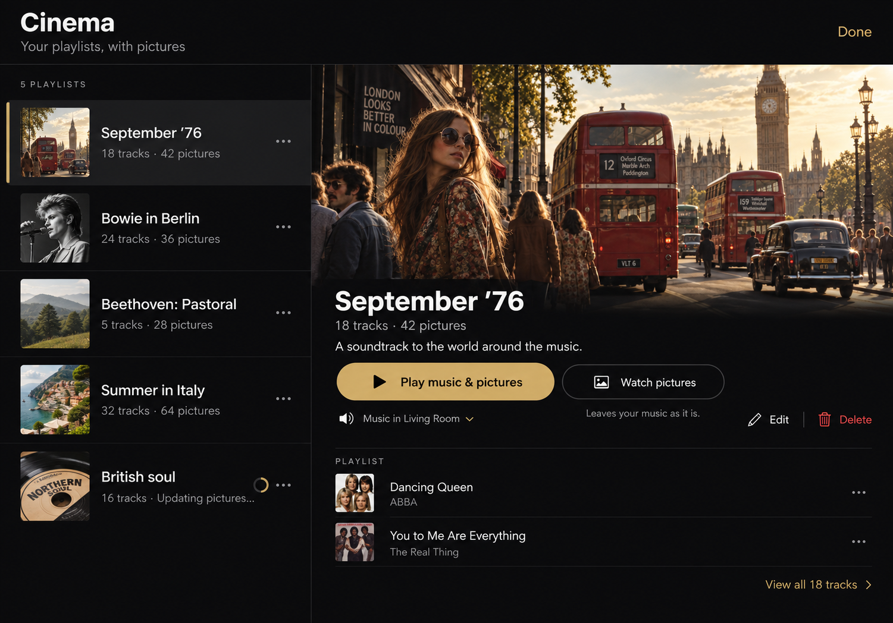
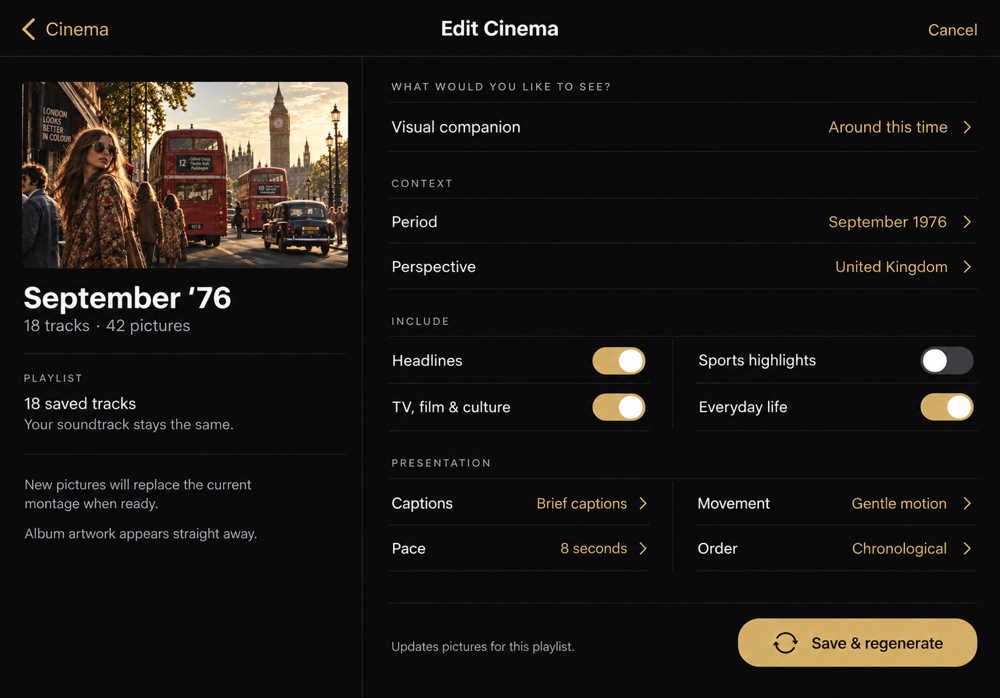
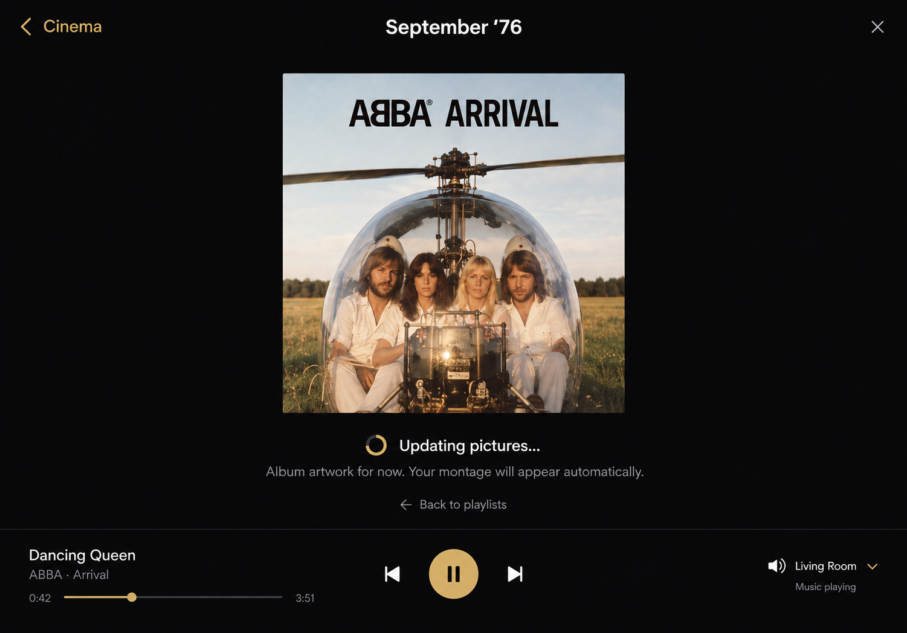

# Cinema playlists — proposed screen flow

18 September 2026 · Design exploration · iPad landscape

Three connected mockups for Cinema as a saved playlist feature owned by this app. These are design proposals, not implemented screens. Images were generated with the built-in image-generation tool, grounded in the existing Cinema setup screenshots and selected Cinema concept. Photographs and album covers are illustrative mock assets.

## Library

Opening Cinema shows the saved playlists and their supporting picture counts. Selecting a row shows a preview and the saved tracks. **Play music & pictures** starts the saved playlist in the selected room and opens the viewer. **Watch pictures** opens the viewer without changing music playback. **Edit** opens the saved visual options. **Delete** removes the saved Cinema item after a confirmation identifying the item; it does not delete music from Roon or originals from Photos. Updating items remain in the list.

## Edit

Change the visual mode, period, perspective, included subjects, captions, motion, pace and order. **Save & regenerate** rebuilds the picture montage using the updated options. The saved soundtrack stays intact. Keep the previous montage until its replacement succeeds. Cancel discards unsaved edits.

## Regeneration

Show an available album cover immediately, fully fitted and crisp. Keep music playback and navigation usable. Show a truthful stage message without an invented percentage or countdown. Switch to the new montage automatically when ready. The illustrated state follows **Play music & pictures**, so music is playing; entering through **Watch pictures** must not start or stop the room's music.

## Prompt direction

- Library: adapt the existing dark native Cinema style into a 1194 × 834 landscape iPad playlist list and selected-item preview. Retain charcoal, ivory and muted gold; make Play music & pictures, Watch pictures, Edit and Delete explicit.
- Edit: adapt the generated library into a focused edit screen with the playlist summary on the left, existing visual options on the right and a persistent Save & regenerate action.
- Regeneration: adapt the same visual system into an immediate album-art viewer with a clear updating message, usable playback controls and navigation back to the library while preparation continues.
