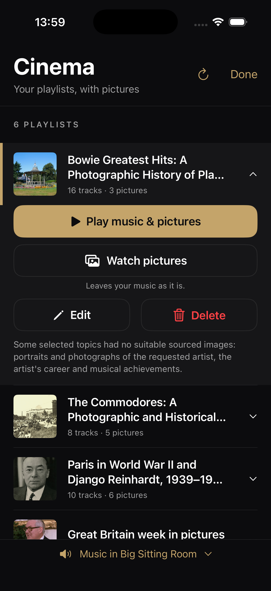
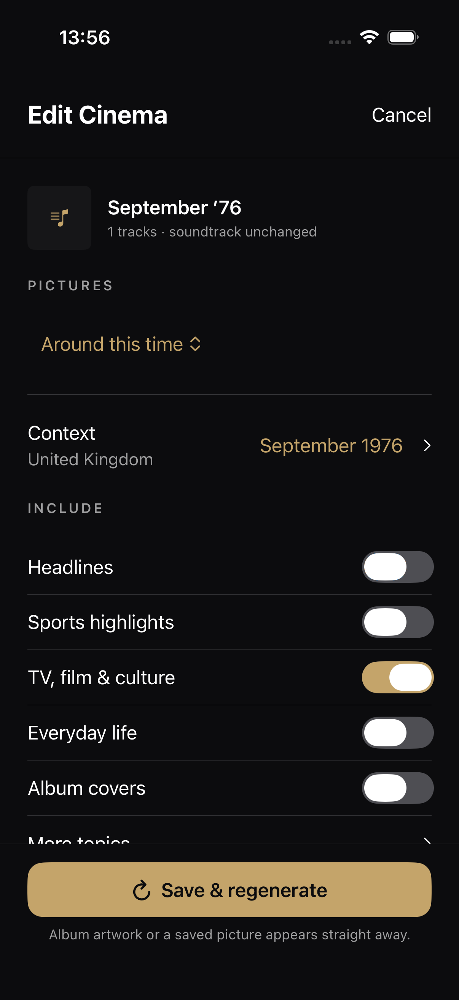
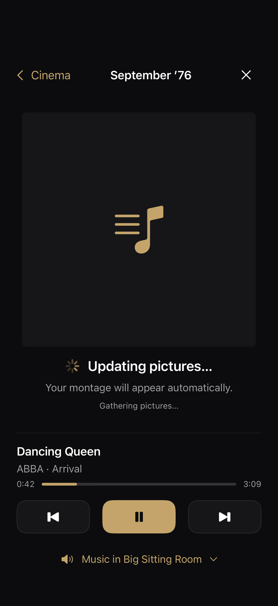
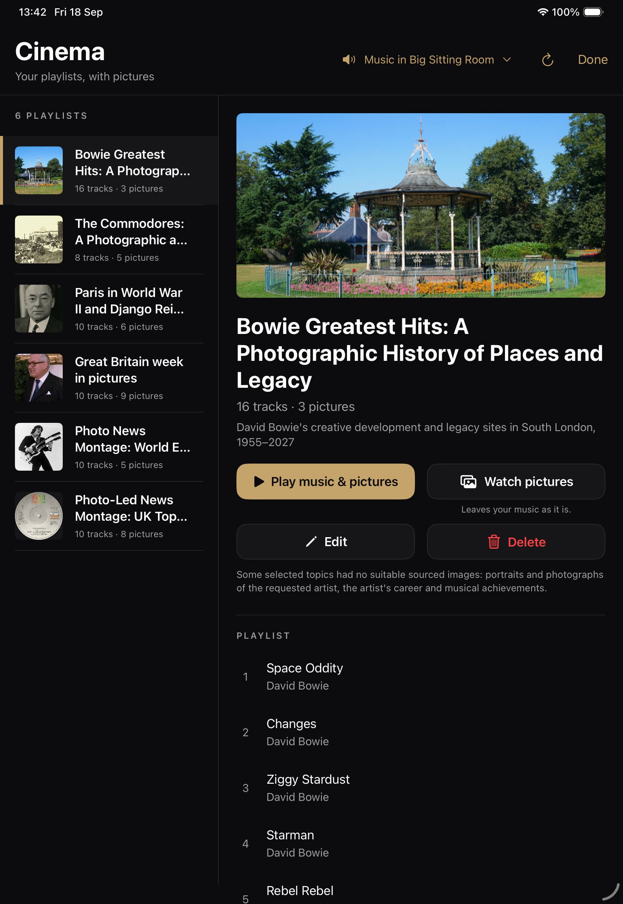
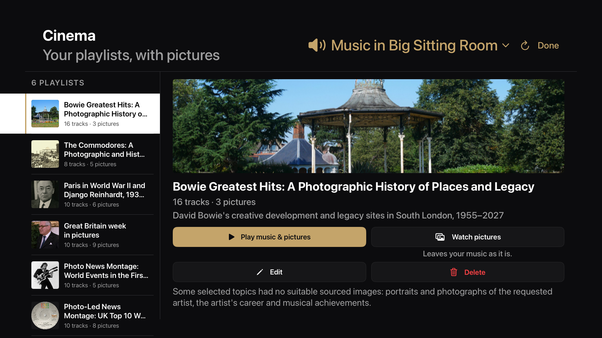
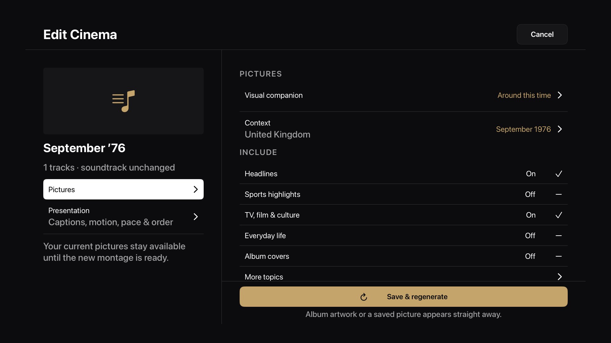
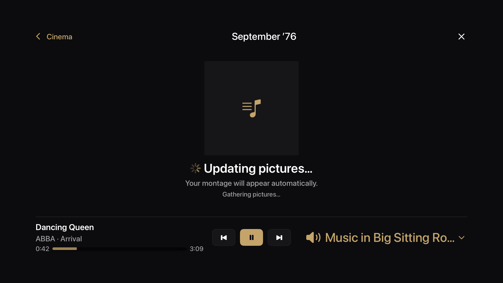

# Cinema playlist implementation — 18 September 2026

Implemented the selected [iPhone and TV direction](cinema-playlists-iphone-tv-mockups.md)
in the existing SwiftUI app, with the matching playlist lifecycle in `roon-web-stack`.

## Behavior

- Cinema opens the saved library on iPhone, iPad and TV.
- Play starts the saved track snapshot in the chosen Roon room; Watch sends no music commands.
- Edit restores saved context, topics and presentation settings. Save & regenerate retains
  the soundtrack and identity, keeping the old montage until its replacement succeeds.
- Album artwork starts loading during setup through a separate Roon browse session. The
  preparation player immediately uses already loaded room artwork while the playlist cover loads,
  or the previous picture. Watch-only preparation also fetches artwork with no current song.
  Completion replaces only that pending viewer. Each build has a generation identifier; an
  interrupted rebuild cannot return the old saved montage as a successful result.
- Delete requires confirmation. Shared deletion removes the manifest, draft and room associations;
  personal deletion removes the app's copied photos. Original media remains untouched.
- Failed generation and failed deletion remain visible and recoverable. Concurrent edits/deletion
  are rejected, and stale refresh responses cannot restore a removed item.
- Personal-photo editing preserves identity, soundtrack and imported photo files across reloads.

## Validation

| Check | Result |
| --- | --- |
| Native Swift unit tests | 174 passed across 22 suites |
| iPhone UI tests | 4 playlist tests passed: edit/regenerate/watch/delete, failed update, immediate cover with unrelated music, cover with no current music; creation tests passed during initial implementation |
| TV remote UI test | Passed: library → Edit → Save → Watch during generation → finished montage |
| Companion bridge tests | 81 passed across 8 relevant suites |
| Bridge TypeScript and changed-file ESLint | Passed (existing-file formatting retained) |
| Native simulator builds | iOS and tvOS Debug passed; iOS Release passed during initial implementation |

UI checks use isolated clients and external fixtures; they do not generate chargeable research,
delete real saved items or operate a live Roon room. Archive previews use an existing local cache
served over loopback. New preparation tests require a decoded image and use a clearly labelled test cover. Live bridge
artwork lookup also succeeded for the saved Commodores playlist in 1.27 seconds, returning a
405,761-byte JPEG. The live check performed no playback or generation commands.

Reviewed native layouts on iPhone 17 Pro, iPad Pro 11-inch and Apple TV 4K at 1080p.
TV review corrected oversized previews, overlapping system focus plates, editor title sizing
and preparation-player height. Remote traversal uses XCTest's `XCUIRemote`.

The local bridge runs in watch mode and has automatically loaded the companion changes. The
installed iPhone app still needs rebuilding/reinstalling. Edit/delete require `managementVersion:1`.
Physical Apple TV remote behavior and live Roon playback across devices remain hardware acceptance checks.

## Implemented screens

## Reproduction

Use Xcode's `RoonRemote` scheme for native unit/iPhone UI tests and `RoonRemoteTV` for the
remote UI test. The repository's `project.yml` includes the new TV UI-test target and shared fixture.
Debug library previews accept the environment switches documented in [the implementation guide](../time-capsule.md).

Bridge changes are limited to `src/ai-service/time-capsule.ts`,
`src/ai-service/cinema-library.test.ts`, `src/route/time-capsule-route.ts`,
`src/route/time-capsule-route.test.ts`, `src/service/cinema-artwork.ts`,
`src/service/cinema-artwork.test.ts`, `src/ai-service/cinema-responses.ts`,
`src/ai-service/cinema-responses.test.ts`, `src/ai-service/cinema-portraits.test.ts`,
`src/ai-service/capsule-options.ts` and `doc/time-capsule.md` in the companion repository.

## Timeout recovery follow-up

- Native tests simulate a lost polling request and prove recovery reaches the original generation without restarting it. Permanent errors still stop polling. A simulated clock proves a long build keeps running while its stages advance.
- Bridge tests cover a real `DOMException` timeout, bounded retry budgets, transient HTTP failures, saved research reuse, uncached structured output, and persisted failure details after restart.
- The live Bowie check uses the saved 16-track request with artist pictures, career and places in an isolated cache. It does not change saved Cinema items or music playback.

The live Bowie run reproduced the previous 150-second research limit on the career topic. Its single slower retry completed successfully and retained completed portrait research. Image selection then exposed a separate problem: researched studio-portrait captions demanded exact photographs that the reusable archives did not supply. Artist portraits now use the available photograph's own date and attribution, retaining subject, licence and visual-quality checks.

Resuming the saved draft with that fix completed successfully: 16 distinct downloaded pictures, including 7 artist portraits, 7 career pictures and 2 places. All files and attribution metadata were present. The resumed image phase took 4 minutes 42 seconds; this is not the duration of a fresh research run. The result stayed in the isolated test cache. Live Bowie album-art lookup also returned a 238,190-byte JPEG in 1.88 seconds.

The reproduced timeout led to a 300-second initial budget for web research (structured outputs remain at 150 seconds). Both paths permit one bounded 300-second retry; the longer research budget prevents an unnecessary early restart.
