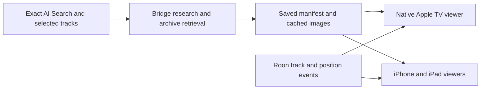

# Time Capsule — Cinema

Cinema direction selected · 17 September 2026 · First implementation available locally

## Design principle

Create a silent visual companion to **whatever the listener asked AI Search for**. The original request and selected tracks define the subject, dates and region. A chart week, an artist's career, a musical scene or a genre each produces its own programme. Nothing is fixed to a particular month or year.

Preserve the original search and its submission date, so relative dates remain stable on replay. Research exact chart editions when the request calls for them. State date and regional assumptions visibly; distinguish earlier context from events in the requested period. Never invent news to fit a mood query.

## Chosen direction

This image-generated concept illustrates composition only. Its historical imagery and album art are not authenticated assets and are not bundled in the app.

Use one large archive photograph, charcoal shadows, white type and muted gold details. Keep a discreet context label above a short headline and two-sentence caption. Slow image motion and dissolves create a cinematic experience while Roon supplies the music. Preserve source credits and photographic dates.

Apple TV and larger iPad layouts use immersive imagery with captions over a shaded lower area. iPhone portrait gives the image and caption separate space; longer captions scroll. Controls appear on interaction and fade when idle. Reduce Motion keeps imagery static; VoiceOver keeps controls available.

## Journey

1. AI Search returns music. The listener adjusts the result list and chooses **Create Time Capsule**.
2. The bridge researches that exact request and gathers permitted archive imagery. Music can continue during preparation.
3. The saved programme appears in **Cinema** with its subject, track count and story count.
4. **Play with Cinema** starts the saved music in the selected room and opens the visuals. **Watch** opens visuals alone.
5. A second device selects the same room and chooses **Join**. The native TV app can continue independently of the phone.
6. **Explore this story** holds the local scene and opens its sources while music continues. **Return to live** resumes automatic following.

Story navigation and music transport are separate controls. Closing the viewer never stops the music. Pause holds the programme's position; seek and track changes choose scenes using Roon's playback state.

## Content rules

AI researches and edits retrieved evidence. Each story needs a real retrieved source URL. Summaries are labelled as AI-written in source details. Original headlines and newspaper facsimiles must never be fabricated.

Prefer dated photographs of the actual story subject. When unavailable, use a separately chosen photograph of the wider setting, labelled **Context photograph**, with its actual date. Do not imply that a generic city photograph depicts a specific event. If no suitable image exists, use artwork or a quiet dark background.

Keep image caption, creator, licence and source accessible. Broad archival coverage is a content-provider problem; the viewer must remain useful when material is scarce. Later events do not belong in an earlier requested period. Model research still needs practical quality review before release.

## Architecture

The bridge owns research credentials, shared saved programmes and room associations. Each native client renders text and imagery locally against the same Roon playback position. The result looks like video while retaining readable captions, live sources and responsive layouts.

## Current scope and future work

The implemented first version is dynamic research, Commons imagery, saved replay, room joining and native Cinema rendering. See [implementation, setup and validation](../time-capsule.md) for precise behaviour and limits.

Future additions: licensed newspaper archives; explicit chart-date/rank metadata and date editing; queue-item identity for repeated recordings; shared TV control and viewer discovery; manifest corrections and deletion; optional silent AirPlay video and archival clips. None requires replacing the request-driven model with a curated fixed programme.
