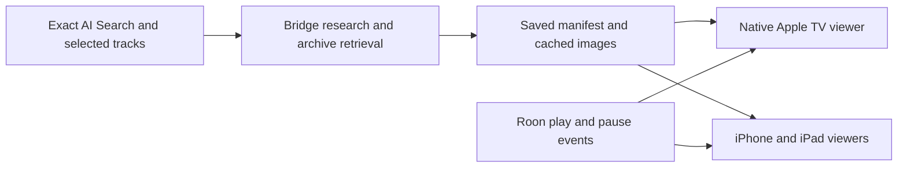

# Time Capsule — Cinema

Cinema direction selected · 17 September 2026 · Revised as a continuous photo montage

## Design principle

Create a silent visual companion to **whatever the listener asked AI Search for**. The original request and selected tracks define the subject, dates and region. A chart week, an artist's career, a musical scene or a genre each produces its own programme. Nothing is fixed to a particular month or year.

Preserve the original search and its submission date, so relative dates remain stable on replay. Research exact chart editions when the request calls for them. State date and regional assumptions visibly. Headlines concern events within the period; an earlier photograph must show the correct subject and carry its actual date. Never invent news to fit a mood query.

## Chosen direction

This image-generated concept illustrates composition only. Its historical imagery and album art are not authenticated assets and are not bundled in the app.

Use one large archive photograph, charcoal shadows, white type and muted gold details. Keep a discreet context label above a short headline. Longer explanations belong in the source sheet, away from the main montage. Slow image motion and dissolves create a cinematic experience while Roon supplies the music. Preserve source credits and photographic dates.

Apple TV, iPad and iPhone show clear photographs fitted to the screen, with a short headline over a shaded lower area. Never blur or excessively enlarge an image to fill the display. Controls appear on interaction and fade when idle. Reduce Motion keeps imagery static; VoiceOver keeps controls available.

## Journey

1. AI Search returns music. The listener adjusts the result list and chooses **Create Time Capsule**.
2. The bridge researches that exact request and gathers permitted archive imagery. Music can continue during preparation.
3. The saved programme appears in **Cinema** with its subject, track count and photograph count.
4. **Play with Cinema** starts the saved music in the selected room and opens the visuals. **Watch** opens visuals alone.
5. A second device selects the same room and chooses **Join**. The native TV app can continue independently of the phone.
6. Photos change every eight seconds, whether or not music plays. A swipe or the photograph transport moves between pictures, and a hold button stops the montage without stopping the music. An information button holds the current photograph and opens its sources; dismissing the sheet continues the montage.
7. **Rebuild montage** gathers new events and photos for the original request, including upgrading older story-based capsules.

Photo navigation and music transport are separate controls. Closing the viewer never stops the music. The photo clock runs independently: music pauses, song changes and seeks leave the montage flowing. A separate picture pause lets the listener hold a photo without stopping music.

## Content rules

AI researches and edits retrieved evidence. Each story needs a real retrieved source URL. Summaries are labelled as AI-written in source details. Original headlines and newspaper facsimiles must never be fabricated.

For a week/year search, research the world that week: news, politics, economy, sport, culture and people. Music is the soundtrack, not the default subject of every image. Each headline describes one sourced event within the requested dates.

Prefer contemporary photographs of that event. Earlier photographs of the exact headline subject can be used with their actual date visible. Reject unknown chronology, later photos and peripheral or unrelated subjects. Associate images using explicit identifiers, never model-counted array positions. Avoid duplicates and alternate crops of the same picture.

An AI visual review checks downloaded images for obvious blur, pixelation and subject relevance. Only accepted, downloaded images enter playback. Omit headlines without suitable photographs. Never substitute blurred album art or repeat a single background behind different headlines. Require at least three distinct photographs to call the montage ready, and show its photo count in the library. Keep creator, licence and sources accessible.

## Architecture

The bridge owns research credentials, shared saved programmes and room associations. Each native client renders the montage locally, pacing photos independently of song boundaries and following the room’s play/pause state. Joining does not guarantee identical frames on different screens. The result looks like video while retaining readable captions, live sources and responsive layouts.

## Current scope and future work

The adaptive **Set up Cinema** sheet now offers period, artist, work and personal-photo
modes with appropriate topics, caption density, motion, pace and order. The mode picker
uses a compact native menu on iOS. Classical setup distinguishes work/composer context
from the recording. My photos accepts individual selections or an album snapshot and
keeps copied images on the device. See the adaptive setup section in the implementation
guide for the saved request contract, bridge compatibility and Photos permissions.

The implemented first version is dynamic research, Commons imagery, saved replay, room joining and native Cinema rendering. See [implementation, setup and validation](../time-capsule.md) for precise behaviour and limits.

Future additions: licensed newspaper archives; explicit chart-date/rank metadata and date editing; frame-exact synchronisation between screens; shared TV control and viewer discovery; manifest corrections and deletion; optional silent AirPlay video and archival clips. None requires replacing the request-driven model with a curated fixed programme.
